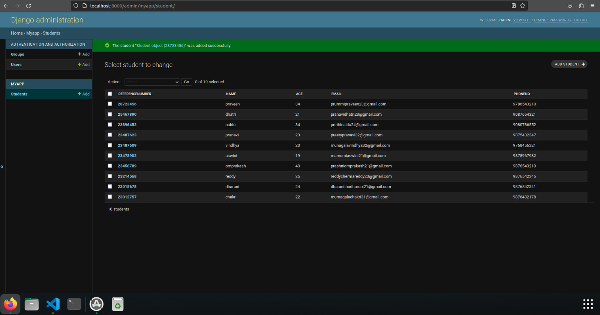

# Django ORM Web Application

## AIM
To develop a Django application to store and retrieve data from a database using Object Relational Mapping(ORM).

## Entity Relationship Diagram

Include your ER diagram here

## DESIGN STEPS

### STEP 1:
Start the program.
### STEP 2:
Get the values from the user.
### STEP 3:
End the program.
Write your own steps

## PROGRAM:
```
from django.db import models
from django.contrib import admin


# Create your models here.
class Student (models.Model):
    referencenumber=models.CharField(primary_key=True,max_length=20,help_text="reference number")
    name=models.CharField(max_length=100)
    age=models.IntegerField()
    email=models.EmailField()
    phoneno=models.IntegerField()


class StudentAdmin(admin.ModelAdmin):
    list_display=('referencenumber','name','age','email','phoneno')

admin.py

from django.contrib import admin
from .models import Student,StudentAdmin
# Register your models here.
admin.site.register(Student,StudentAdmin)

```

## OUTPUT




## RESULT
Thus the program executed successfully.
